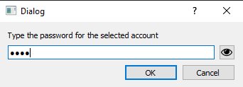
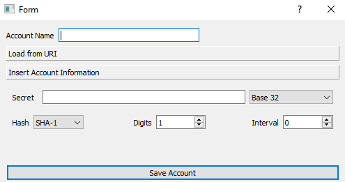
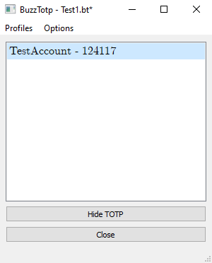

# TOTP Qt Gui - buzz-totp-gui
Gui Application for TOTP accounts management

# Overview
The application manages the creation of Profiles that stories a list of TOTP Account.
Each profile is stored in an encrypted (AES-256) file *.bt
An account contains the following set of information:
- Name
- Secret
- Digest (currently available SHA-1, SHA-256, SHA-512, MD5)
- Interval
- Digits

## Features
- Copy/Paste otpauth in ListView to automatically add new account
- Automatic TOTP code hide after 1 renew
- Copy to clipboard when showing TOTP 

# Screenshot

## Load or Create profile window

## Password Input

## Create Account

## Profile Main View

# Third Party Libraries:
The application makes use of:
- [pyotp](https://pypi.org/project/pyotp/)
- [cryptography](https://pypi.org/project/pycryptodome/)
- [password-validator](https://pypi.org/project/password-validator/)
- [PyQt5](https://pypi.org/project/PyQt5/)

